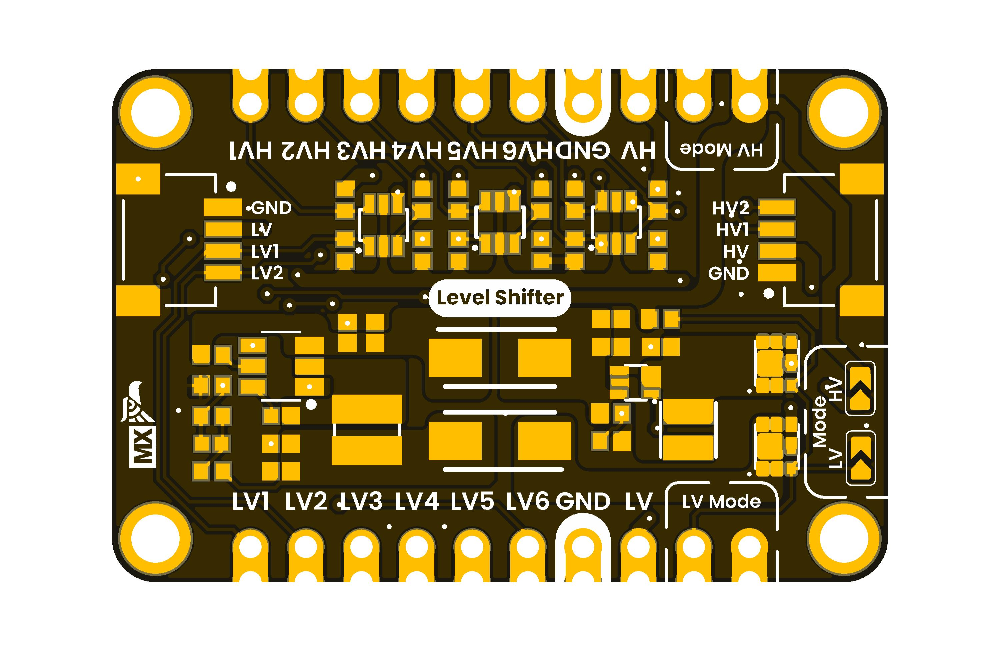

# DevLab: I2C Qwiic Converter Module

A bidirectional I2C level shifter module for seamless 3.3V↔5V communication. Features integrated voltage regulators and Qwiic/STEMMA QT connectors for easy sensor integration.

## Key Features

- **Bidirectional Level Shifting:** DIP switch selectable for buck (5V→3.3V) or boost (3.3V→5V)
- **Qwiic/STEMMA QT Compatible:** Daisy-chain multiple sensors effortlessly
- **Compact Design:** Breadboard-friendly with minimal footprint
- **No Additional Wiring:** Integrated power conversion for mixed-voltage systems

  
  
<em>Development Board</em>

## Quick Start

## Specifications

| Specification | Value |
|---|---|
| Input Voltage (High) | 5V ± 0.3V |
| Input Voltage (Low) | 3.3V ± 0.1V |
| I2C Speed | 100 kHz - 400 kHz |
| Connector | Qwiic/STEMMA QT |
| Operating Temp | 0°C to 50°C |

## Use Cases

- Mixed-voltage IoT projects
- Multi-sensor prototyping
- I2C device bridging

## 📝 License

Licensed under the **MIT License**. See [`LICENSE.md`](LICENSE.md).

  Created by UNIT Electronics

