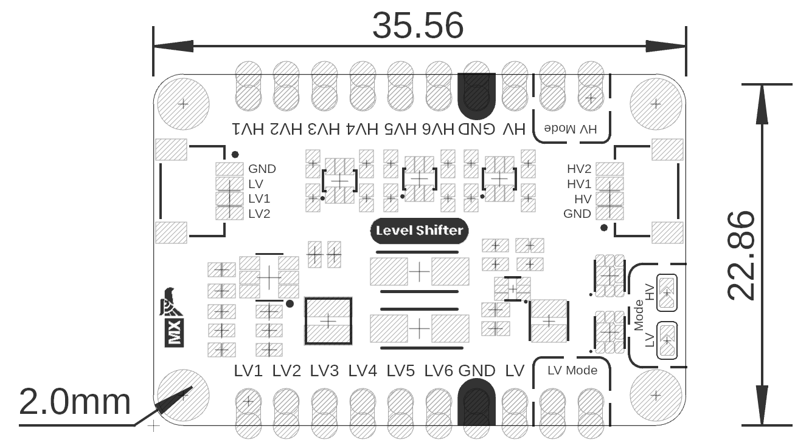
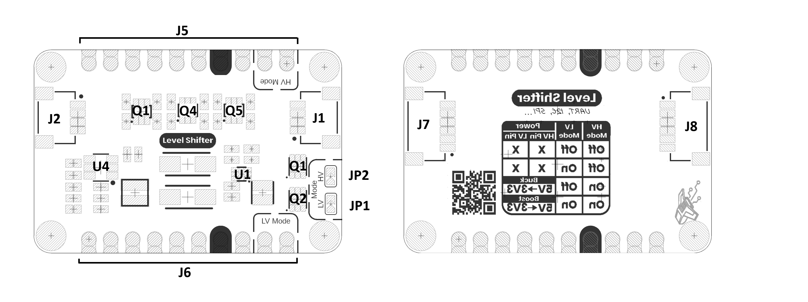

# Hardware

<a href="https://github.com/UNIT-Electronics-MX/unit_devlab_i2c_qwiic_converter_module/blob/main/hardware/unit_sch_v_1_0_0_ue0106_i2c_qwiic_converter_module.pdf">
 
Schematic
</a>

---

## Electrical Characteristics

| Parameter | Description | Min | Typ | Max | Unit |
|---|---|---|---|---|---|
| VIN | Input supply voltage for module operation | 2.5 | 3.3 / 5.0 | 5.5 | V |
| VLV | Low-voltage rail operating range | 1.8 | 3.3 | 5.0 | V |
| VHV | High-voltage rail operating range | 3.3 | 5.0 | V |
| IOUT-LV | Maximum output current for LV rail | - | - | 1 | A |
| IOUT-HV | Maximum output current for HV rail | - | - | 1 | A |
| VIH | Input high-level voltage for I²C logic | 0.7 × VCC | - | - | V |
| VIL | Input low-level voltage for I²C logic | - | - | 0.3 × VCC | V |
| VOH | Output high-level voltage for I²C logic | 0.8 × VCC | - | - | V |
| VOL | Output low-level voltage for I²C logic | - | - | 0.2 × VCC | V |
| fI2C | Supported I²C bus frequency | 0 | 100 | 400 | kHz |
| TAMB | Recommended operating ambient temperature | -20 | 25 | 85 | °C |
| RPULLUP | Integrated pull-up resistor value | - | 10 | - | kΩ |
| ESD | ESD protection level (HBM typical) | - | ±2 | - | kV |

> **Note 1:** Maximum output current depends on thermal dissipation, PCB layout, and input voltage conditions.

> **Note 2:** The module integrates bidirectional MOSFET-based level shifters optimized for open-drain I²C communication.

> **Note 3:** Qwiic/STEMMA QT connectors share the same I²C bus signals (VCC, GND, SDA, SCL) for daisy-chain operation.

> **Note 4:** Operating voltage ranges may vary depending on external power configuration and selected LV/HV mode.

## Pinout

<a href="#">
 
Pinout
</a>

### Pin & Connector Layout

| Pin Label | Function | Notes |
|---|---|---|
| VCC | Power Supply | 3.3V or 5V |
| GND | Ground | Common ground for all components |

---

## Dimensions

<a href="./resources/unit_dimensions_v_1_0_0_ue0106_i2c_qwiic_converter_module.png">
 
Dimensions
</a>

---

## Topology

<a href="./resources/unit_topology_v_1_0_0_ue0106_i2c_qwiic_converter_module.png">
 
Topology
</a>

### Topology Description

| Ref. | Description |
|---|---|
| U1 | Boost converter circuit based on TPS61023 for LV power rail generation |
| U4 | Buck converter circuit based on TPS54302DDCT for HV power rail generation |
| Q1, Q4, Q5 | Bidirectional I²C level shifter circuits based on 2N7002KDW MOSFETs |
| Q2, Q3 | Power switching MOSFET stage for voltage rail selection/control |
| J1, J2 | Qwiic/STEMMA QT connectors (JST 1.0 mm pitch) for I²C interface |
| J5, J6 | Castellated 1x10 pin headers (2.54 mm pitch) for external module integration |
| J7, J8 | 1x6 pin headers/connectors for HV/LV mode configuration and external interfacing |
| JP1 | LV Mode solder jumper selector |
| JP2 | HV Mode solder jumper selector |

> **Note:** The module also includes a Qwiic/STEMMA QT connector carrying the same four signals (VCC, GND, SDA, SCL) for effortless daisy-chaining.

---

## Functional Description

The **DevLab Qwiic I²C Converter Module** is a bidirectional voltage level shifter designed for seamless communication between low-voltage and high-voltage I²C devices. The module enables safe interfacing between 3.3V and 5V systems using MOSFET-based bidirectional level translation.

The design integrates dedicated boost and buck power conversion stages to generate and regulate the required voltage rails for both LV and HV domains. Multiple Qwiic/STEMMA QT connectors and castellated interfaces simplify integration with embedded systems, development boards, sensors, and expansion modules.

### Features

- Bidirectional I²C level shifting
- Qwiic/STEMMA QT compatibility
- Castellated edge connections for embedded integration
- Configurable LV/HV operating modes
- 3.3V and 5V logic interoperability
- Daisy-chain I²C connectivity

### Typical Applications

- Sensor interfacing
- Mixed-voltage embedded systems
- Rapid prototyping
- Development board expansion
- Qwiic/STEMMA QT ecosystem integration

# References

- [TPS61023 Datasheet](https://www.ti.com/lit/ds/symlink/tps61023.pdf)
- [TPS54302 Datasheet](https://www.ti.com/lit/ds/symlink/tps54302.pdf)
- [2N7002KDW Datasheet](https://assets.nexperia.com/documents/data-sheet/2N7002KDW.pdf)