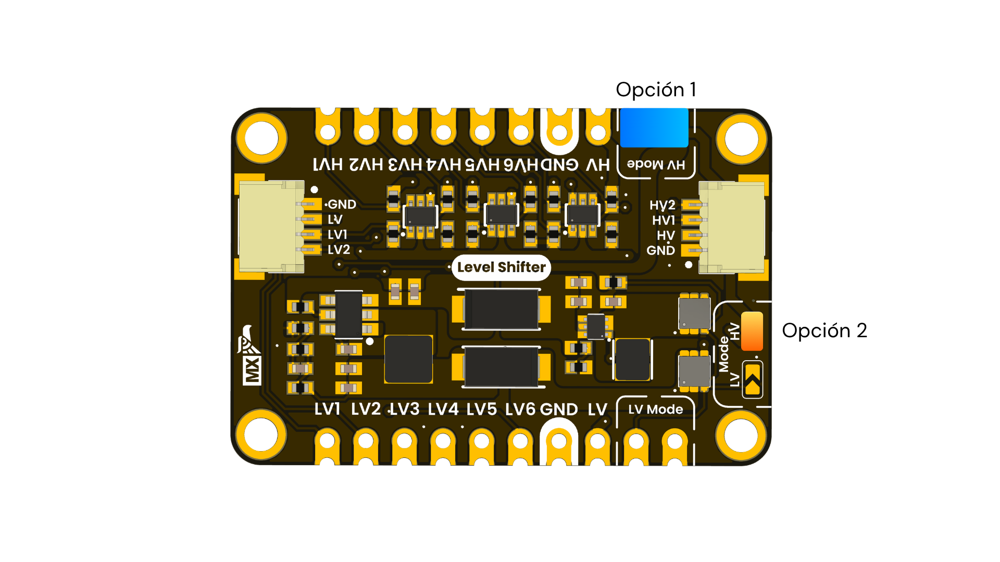
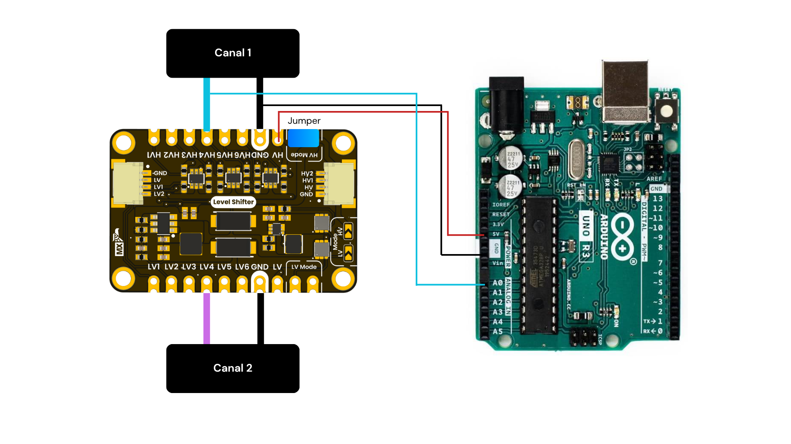
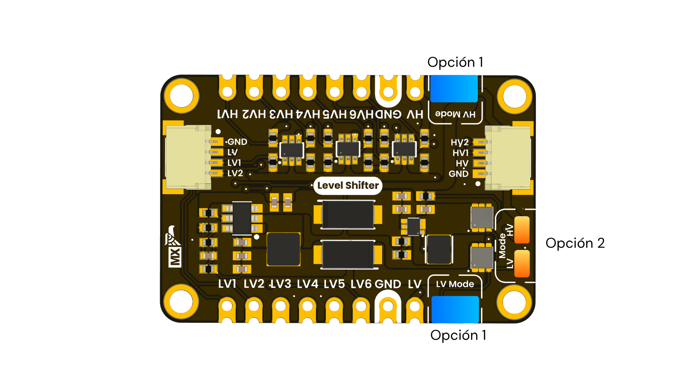
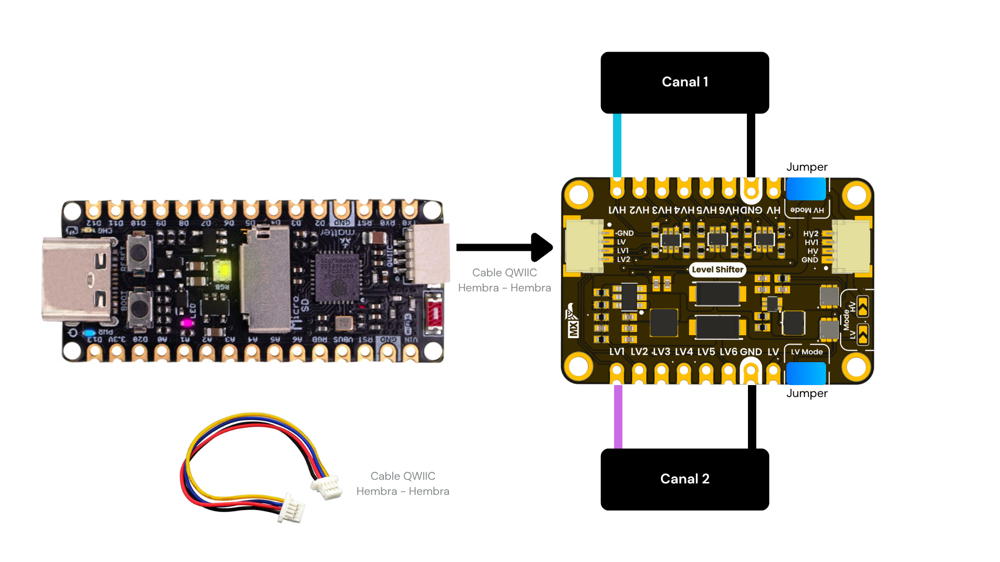
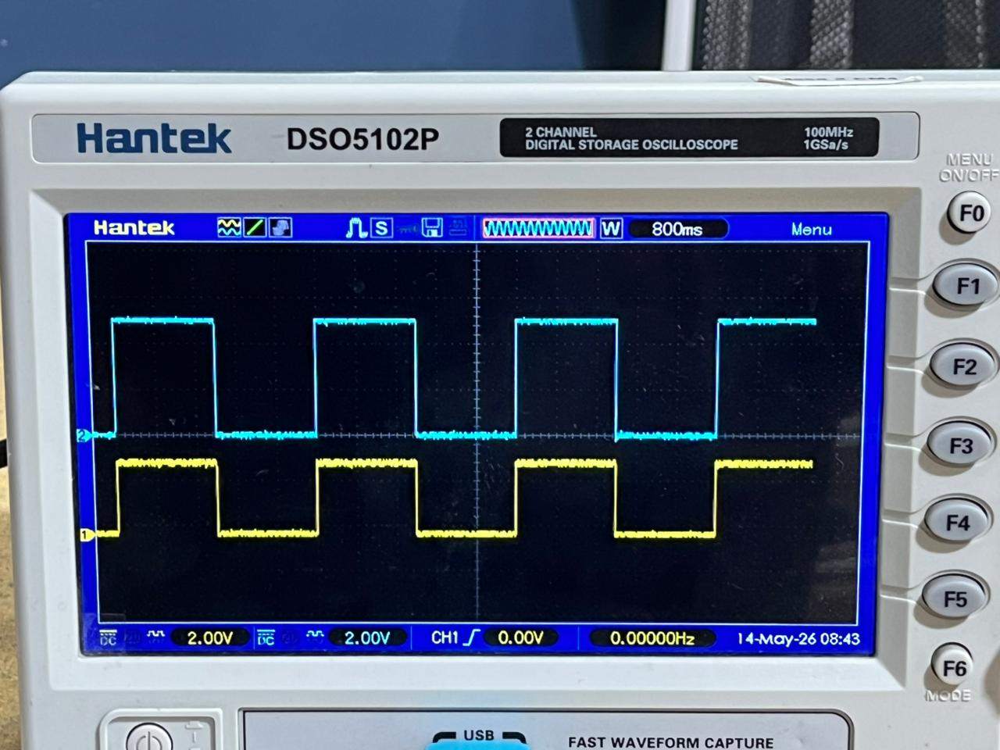

## Buck Mode

### 5 V to 3.3 V Level Conversion

To enable **Buck Mode**, the module must be configured to convert a high-voltage signal into a lower-voltage signal. In this case, the input signal comes from a **5 V microcontroller**, and the module shifts it down to a **3.3 V logic level**.

There are two ways to enable this mode:

1. Place a jumper on the **HV Mode** pins.
2. Solder the exposed pads labeled **HV Mode** for a permanent configuration.

In **Buck Mode**, the input signal must be connected to one of the **HV channels**, from **HV1 to HV6**. The corresponding converted output signal will be available on the matching **LV channel**, from **LV1 to LV6**.

For example:

| Input Signal | Converted Output |
|---|---|
| `HV1` | `LV1` |
| `HV2` | `LV2` |
| `HV3` | `LV3` |
| `HV4` | `LV4` |
| `HV5` | `LV5` |
| `HV6` | `LV6` |

  
  
<em>Buck Mode jumper configuration</em>

---

## Example Circuit

The following image shows a basic test circuit using an **Arduino UNO** and the **I2C QWIIC Converter Module**.

In this setup, the Arduino UNO generates a square wave. Since the Arduino UNO operates with **5 V logic**, the generated signal enters the converter module through one of the **HV channels**. In this example, the signal is connected to **HV4**, which corresponds to **High Voltage Channel 1**.

The **5 V** supply from the Arduino is connected to the **HV** pin of the module, defining the high-voltage side as **5 V**. After placing the required jumper on the **HV Mode** pins, the module converts the square wave from **5 V** to **3.3 V**. The converted signal can then be measured or used from the corresponding low-voltage output, **LV4**.

To verify the conversion, an oscilloscope is used:

- **Oscilloscope Channel 1:** connected to **HV4**, where the original **5 V signal** from the microcontroller is observed.
- **Oscilloscope Channel 2:** connected to **LV4**, where the converted **3.3 V signal** is observed.

This test makes it possible to compare both signals and confirm that the module is correctly shifting the logic level from **5 V to 3.3 V**.

  
  
<em>Buck Mode test circuit</em>

## Boost Mode

### 3.3 V to 5 V Level Conversion

To enable **Boost Mode**, the module must be configured to convert a low-voltage signal into a higher-voltage signal. In this case, the input signal comes from a **3.3 V microcontroller**, and the module shifts it to a **5 V logic level**.

There are two ways to enable this mode:

1. Place one jumper on the **HV Mode** pins and another jumper on the **LV Mode** pins.
2. Solder the exposed pads labeled **HV Mode** and **LV Mode** for a permanent configuration.

  
  
<em>Boost Mode jumper configuration</em>

---

## Example Circuit

The following image shows a basic test circuit using the **UNIT Pulsar C6** development board and the **I2C QWIIC Converter Module**.

In this setup, a **JST QWIIC cable** is connected from the development board to the level converter module. The square wave generated by the microcontroller on **GPIO6** is connected to **LV1**, which corresponds to **Low Voltage Channel 1**. The microcontroller supply voltage is also connected to the **LV** pin, defining the low-voltage side as **3.3 V**.

After placing the required jumpers on the **HV Mode** and **LV Mode** terminals, the module converts the square wave from **3.3 V** to **5 V**. This allows the signal generated by the microcontroller to be used with circuits or devices that require **5 V logic levels**.

To verify the conversion, an oscilloscope is used:

- **Oscilloscope Channel 1:** connected to **HV1**, where the converted **5 V signal** is observed.
- **Oscilloscope Channel 2:** connected to **LV1**, where the original **3.3 V signal** from the microcontroller is observed.

This test makes it possible to compare both signals and confirm that the module is correctly shifting the logic level from **3.3 V to 5 V**.

  
  
<em>Boost Mode test circuit</em>

---

## Oscilloscope Verification

The oscilloscope capture shows the behavior of the signal before and after passing through the level converter module.

In this test, the original square wave is generated by the **UNIT Pulsar C6** microcontroller at **3.3 V logic level** and is applied to the low-voltage side of the module. After the signal passes through the converter in **Boost Mode**, the output signal is shifted to approximately **5 V logic level**.

The two oscilloscope channels allow both signals to be compared at the same time:

- **Channel 1:** converted signal on the **HV side**, approximately **5 V**.
- **Channel 2:** original signal on the **LV side**, approximately **3.3 V**.

Both waveforms keep the same timing behavior, including the pulse width, period, and duty cycle. The main difference between them is the voltage amplitude. This confirms that the module is correctly converting the logic level from **3.3 V to 5 V** without modifying the shape of the digital signal.

  
  
<em>Boost Mode oscilloscope verification</em>

